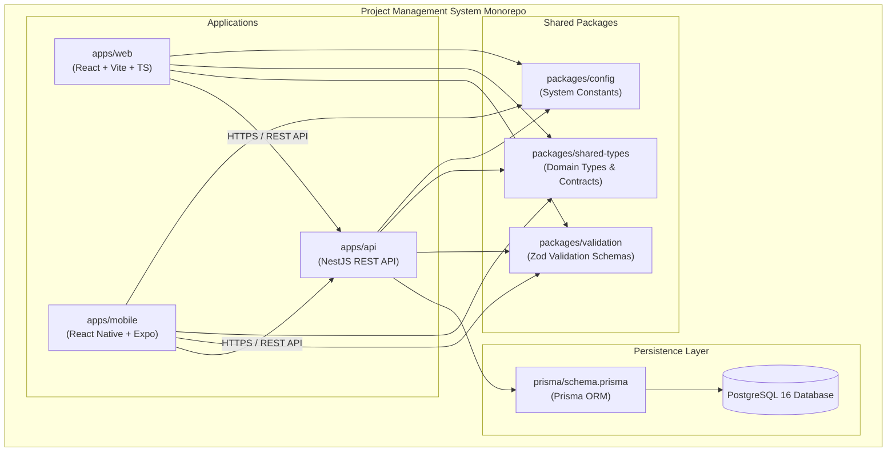
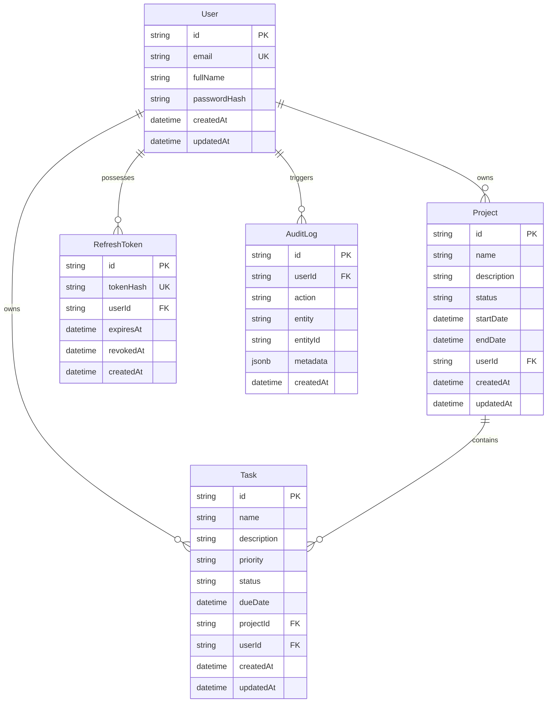

# System Architecture Diagrams

## 1. High-Level Monorepo Topology

```mermaid
graph TD
    subgraph Monorepo ["Project Management System Monorepo"]
        subgraph Apps ["Applications"]
            Web["apps/web<br/>(React + Vite + TS)"]
            Mobile["apps/mobile<br/>(React Native + Expo)"]
            API["apps/api<br/>(NestJS REST API)"]
        end

        subgraph Shared ["Shared Packages"]
            Config["packages/config<br/>(System Constants)"]
            SharedTypes["packages/shared-types<br/>(Domain Types & Contracts)"]
            Validation["packages/validation<br/>(Zod Validation Schemas)"]
        end

        subgraph Persistence ["Persistence Layer"]
            Prisma["prisma/schema.prisma<br/>(Prisma ORM)"]
            PostgreSQL[("PostgreSQL 16 Database")]
        end
    end

    Web --> Config
    Web --> SharedTypes
    Web --> Validation
    Mobile --> Config
    Mobile --> SharedTypes
    Mobile --> Validation
    API --> Config
    API --> SharedTypes
    API --> Validation

    Web -->|HTTPS / REST API| API
    Mobile -->|HTTPS / REST API| API
    API --> Prisma
    Prisma --> PostgreSQL
```

## 2. Relational Entity-Relationship Diagram

```mermaid
erDiagram
    User ||--o{ Project : "owns"
    User ||--o{ Task : "owns"
    User ||--o{ RefreshToken : "possesses"
    User ||--o{ AuditLog : "triggers"
    Project ||--o{ Task : "contains"

    User {
        string id PK
        string email UK
        string fullName
        string passwordHash
        datetime createdAt
        datetime updatedAt
    }

    Project {
        string id PK
        string name
        string description
        string status
        datetime startDate
        datetime endDate
        string userId FK
        datetime createdAt
        datetime updatedAt
    }

    Task {
        string id PK
        string name
        string description
        string priority
        string status
        datetime dueDate
        string projectId FK
        string userId FK
        datetime createdAt
        datetime updatedAt
    }

    RefreshToken {
        string id PK
        string tokenHash UK
        string userId FK
        datetime expiresAt
        datetime revokedAt
        datetime createdAt
    }

    AuditLog {
        string id PK
        string userId FK
        string action
        string entity
        string entityId
        jsonb metadata
        datetime createdAt
    }
```
