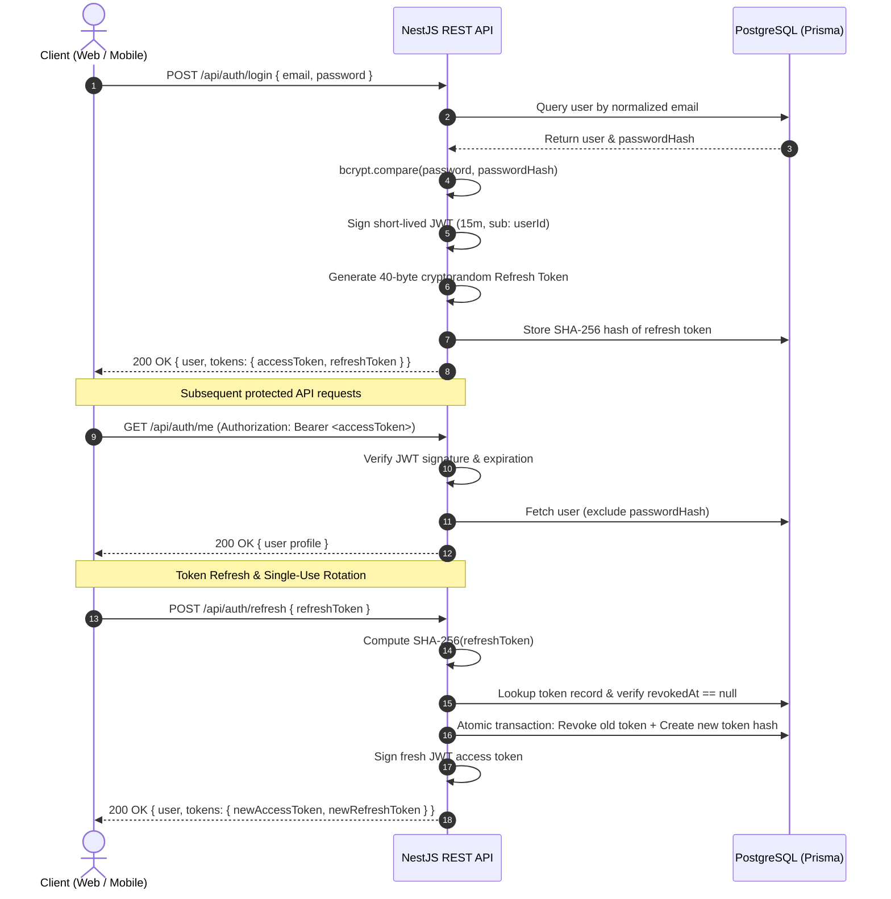

# Authentication & User Management Security Architecture

This document outlines the security architecture, threat model, cryptographic decisions, and session management mechanisms implemented in Module 01.

---

## 1. Overview & Security Philosophy

The Project Management System employs a dual-token authentication scheme consisting of:

- **Short-Lived JWT Access Tokens** (15-minute default) for stateless, fast request authentication.
- **Long-Lived Rotating Refresh Tokens** (7-day default) for revocable, stateful session lifecycle management with automatic reuse detection.



---

## 2. Password Security & Storage

### Bcrypt Hashing with 12 Salt Rounds

- Passwords are encrypted before persistence using `bcryptjs` with **12 salt rounds**.
- Cost factor 12 provides robust defense against modern GPU/ASIC rainbow table and brute-force attacks (~250ms work factor per hash).
- Salt is generated cryptographically per password, preventing identical hashes across identical passwords.

### Strict Non-Disclosure & Hygiene Rules

1. **Never persist plaintext:** Plaintext passwords exist solely in volatile request memory during hashing or comparison.
2. **Never return password hashes:** Database projections and transformation mappers strictly omit `passwordHash` from DTOs and API responses (`SafeUser`).
3. **Never log sensitive fields:** Structured loggers log only high-level security events with sanitized metadata (`userId`, `email`), omitting passwords and raw tokens.
4. **Email Normalization:** All emails are automatically trimmed and downcased (`toLowerCase()`) to prevent duplicate registrations and case-manipulation impersonation.

---

## 3. JWT Access Token Strategy

- **Lifespan:** 15 minutes (`JWT_ACCESS_EXPIRES_IN`), configured via environment variables.
- **Minimal Claims:** Access tokens include only the subject claim `{ sub: userId }`.
  - Avoids bloat and reduces bearer transmission overhead.
  - Prevents stale authorization data (e.g., changes to roles, emails, or status are always evaluated against authoritative state or upon refresh).
- **Signature:** Signed via HMAC-SHA256 (`HS256`) using `JWT_ACCESS_SECRET`.
- **Validation Guard:** `JwtAuthGuard` intercepts requests, extracts the Bearer token, verifies signature and expiration, and cleanly maps errors:
  - Expired tokens throw `TokenExpiredException` (`AUTH_TOKEN_EXPIRED`).
  - Corrupted, tampered, or missing tokens throw `UnauthorizedAuthException` (`AUTH_UNAUTHORIZED`).

---

## 4. Refresh Token Rotation & Session Security

### Cryptographic Opaque Tokens

- Generated using `crypto.randomBytes(40).toString('hex')` (320 bits of entropy).
- Completely opaque to clients.

### SHA-256 Hash Storage

- Raw refresh tokens are **never stored plaintext in the database**.
- Only the SHA-256 hash (`crypto.createHash('sha256').update(token).digest('hex')`) is stored in the `refresh_tokens` table.
- If the database is compromised, the stored hashes cannot be used to authenticate sessions without computing the SHA-256 preimage.

### Single-Use Token Rotation

- Every successful call to `POST /api/auth/refresh` revokes the submitted refresh token (`revokedAt = new Date()`) and generates an entirely new token pair.
- The rotation occurs inside a database transaction (`prisma.$transaction`) to guarantee consistency under concurrent requests.

### Automatic Token Reuse Detection (Compromise Mitigation)

- If a client attempts to refresh using a token whose `revokedAt` timestamp is already populated, an attacker or compromised client may have replayed an intercepted token.
- **Mitigation Action:**
  1. The API immediately logs a critical security alert: `[SECURITY] TOKEN_REUSE_DETECTED userId=... tokenId=...`.
  2. The API invalidates **all active refresh tokens** for that user across all devices:
     ```typescript
     await prisma.refreshToken.updateMany({
       where: { userId: storedToken.userId, revokedAt: null },
       data: { revokedAt: new Date() },
     });
     ```
  3. The request is rejected with `RefreshTokenReusedException` (`AUTH_REFRESH_TOKEN_REUSED`).

---

## 5. Logout & Session Termination

- `POST /api/auth/logout` terminates user sessions.
- **Targeted Revocation:** When `refreshToken` is provided in the body, only that specific device session is revoked.
- **Universal Revocation:** When no specific token is provided (or when the client requests complete sign-out), all active tokens for `userId` are invalidated.

---

## 6. Rate Limiting Protection

- Rate limiting is enforced via `@nestjs/throttler`.
- Global rate limit: 60 requests / minute.
- High-risk endpoints (`/api/auth/register`, `/api/auth/login`, `/api/auth/refresh`) are restricted to **10 requests / minute**.
- Requests exceeding the limit receive HTTP 429 (`RATE_LIMIT_EXCEEDED`).

---

## 7. Standardized Error Catalog

| HTTP Status             | Error Code                   | Description / Trigger                                                         |
| :---------------------- | :--------------------------- | :---------------------------------------------------------------------------- |
| `400 Bad Request`       | `VALIDATION_FAILED`          | Input payload validation failed (e.g. invalid email format, weak password)    |
| `401 Unauthorized`      | `AUTH_INVALID_CREDENTIALS`   | Incorrect email or password during login                                      |
| `401 Unauthorized`      | `AUTH_UNAUTHORIZED`          | Missing, invalid, or malformed JWT Bearer token                               |
| `401 Unauthorized`      | `AUTH_TOKEN_EXPIRED`         | Expired access token or refresh token                                         |
| `401 Unauthorized`      | `AUTH_INVALID_REFRESH_TOKEN` | Non-existent or unrecognized refresh token                                    |
| `401 Unauthorized`      | `AUTH_REFRESH_TOKEN_REUSED`  | Attempted reuse of an already-revoked refresh token; all sessions invalidated |
| `409 Conflict`          | `AUTH_EMAIL_ALREADY_EXISTS`  | Registration attempt with an email that is already registered                 |
| `429 Too Many Requests` | `RATE_LIMIT_EXCEEDED`        | Exceeded endpoint rate limit                                                  |

---

## 8. Client-Side Integration Guidance

### Web Client (React + Vite)

- Access token stored in memory (e.g., React Context / Auth Store).
- Refresh token stored in secure storage or `HttpOnly` cookie.
- Axios/Fetch interceptor catches `401` errors with `AUTH_TOKEN_EXPIRED`, transparently calls `POST /api/auth/refresh`, updates the in-memory access token, and retries the original request.
- If refresh returns `AUTH_REFRESH_TOKEN_REUSED` or `AUTH_INVALID_REFRESH_TOKEN`, clears user state and redirects to `/login`.

### Mobile Client (React Native + Expo)

- Refresh tokens must be stored in hardware-backed secure storage (`expo-secure-store` / Android Keystore).
- Access tokens kept in-memory for active sessions.
- Identical Axios interceptor handles transparent refresh rotation.
